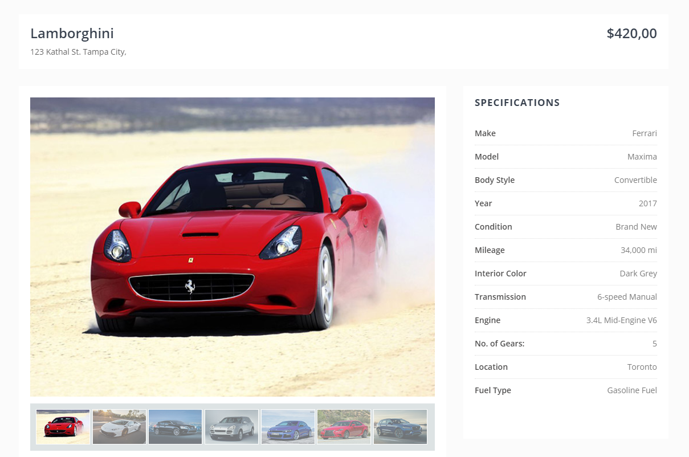

# learning
HTML, CSS, Javascript and Jquery

### Introduction
 - Website
 - Static Website and Dynamic Website
 - Web Programming Languages
 - Backend & DataBase
 - Front end Frameworks
 - Web Server 
 
### HTML 
 - DOM 
 - HTML Introduction
 - HTML structure
 - Div and Span
 - Form elements
 - Image and file links
 - Types of Images
	- JPEG
	- PNG
	- GIF
	- SVG
 - Browser Storage
 - Metadata
 - Goolge Search Indexing

### CSS 
 - CSS Introduction
 - Types of CSS implementation
	- Internal
	- External
	- Inline
 - Element Positioning
	- display
	- Margin
	- Padding
 - CSS animation
 - Responsive Design
 - SCSS and LESS
 - CSS Frameworks
 
### Javascript
 - Javascript Introduction
 - Varibles, array and object
 - Javascript events
 - Debugging
 - Javascript Frameworks
 - Json Format

### jQuery
 - Jquery Introduction
 - Jquery Implementation
 - Javascript & Jquery difference
 - Jquery events
 - Jquery DOM Mainpulation
 - Jquery Traversing 
 - Jquery Ajax 
 
### UI learning design task

#### Level 1
 - Design the web page similar to below UI prototype.
 - Show the collection of small cars on the bottom of the page.-  if you click a small car, it needs to display in large display mode and need to replace the existing large car.
 
#### Level 2
 - Create the JSON object for the collection of cars and details. - Loop it JSON and show the car and details.
 - If you click a small car, it needs to change the large image and details as well.
 

 
 